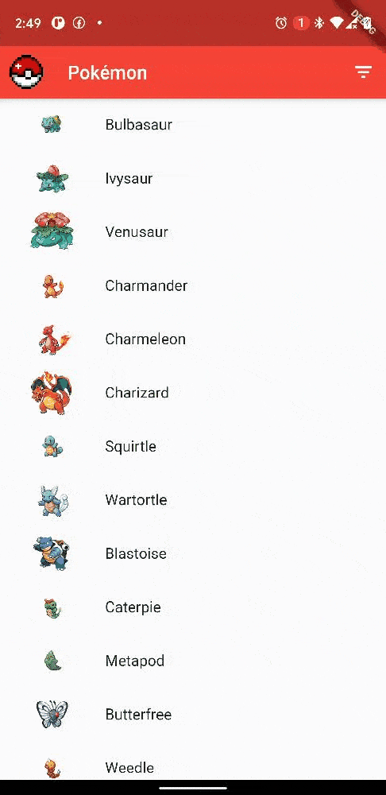

### parakeet-repository

- [ParakeetPokedex*](#parakeet-repository-)
- [What is?](#what-is)

<small><i><a href='http://ecotrust-canada.github.io/markdown-toc/'>Table of contents generated with markdown-toc</a></i></small>

# What Is?

**Pokedex App for education porpose in Flutter***, is a basic application where we generate an infinite scrolling list where we will show all the Pokémon that exist within the  [PokeAPI: https://pokeapi.co/](https://pokeapi.co/) in it we have a view of filtering the Pokémon by type and a detail view where the sprites of each pokemon as if it were a GBA games, the weight and its type

Developed by: 

- [@jcellomarcano](https://github.com/jcellomarcano)

# How run it? 

1. Have Flutter and Dart downloaded

2. Download the repository

3. Depending on whether you open it in VS code or in Android Studio, download the necessary plugins

After that, run
  `$ flutter doctor`

  (Note: Here you will see a list of checks that you must comply with for the project to run and work correctly, however not all of them are 100% dependent for the execution of the program. At least you must have the plugins installed correctly and that you can verify that you have devices being Android or iOS)

Then, when starting the project, the execution of:

      `$ flutter pub get`
Thus we obtain the dependencies of pubspect.yaml which is the dependency manager that flutter has within the entire project.

4. Then you can run the Pokedex program, using:

  `$ flutter run`
    the framework will immediately recognize the connected devices on which it can run.

If you are in Android Studio it will be enough to select the device in the top bar next to the main that will run the application. (for both iOS and Android)

# Versiones

## Versión Final 1.0
10/09/2020 

This is a basic initial version that allows to have a list view of the Pokémon, a simple welcome screen at login, a detail view and the filter of Pokémon by types

# About implementation

This project is based on the BLoC structure

BLoC is the one who orders the Business Logic Components. BLoC is that everything in the app should be represented as stream of events: widgets submit events; other widgets will respond. BLoC sits in the middle, managing the conversation

BLoC is in charge of managing all our UI that are inside the containers in charge of receiving all the data that we handle inside the repository

:robot: :speech_balloon: *- Hello, World! -* 

Test doing a PokeAPI with Flutter
This is a bic Pokedex app with a little PAge for login. 

Use the API of PokeAPI. 
used dependencies
This for the structure and Architecure of all the App, because BLoC is basically the default architecture in flutter
  bloc: ^3.0.0
  flutter_bloc: ^3.2.0
  
  equatable: ^0.6.1 : make to me more easy comparissons 
  
  cached_network_image: this for maintain the cache of the previous igm of pokemon downloaded for the list
  cached_network_image: ^2.0.0
  http for connectiosc with the REST API
  http: ^0.12.0+4
  JSON anotation to manage JSONS
  json_annotation: ^3.0.0
  
  
